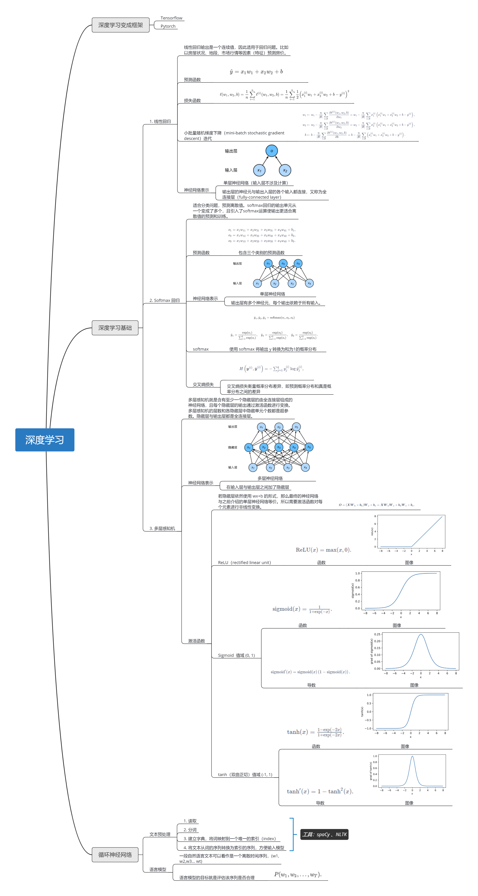

深度学习笔记

> 参考
>
> - [《动手学深度学习》](http://zh.d2l.ai/)
>
> - [《动手学深度学习》(TF2.0版)](https://trickygo.github.io/Dive-into-DL-TensorFlow2.0/#/)，
> - [ElitesAI·动手学深度学习](https://www.boyuai.com/elites/course/cZu18YmweLv10OeV)
>

**目录**

- [x] 线性回归（[md](articles/1.线性回归.md)，[ipynb](articles/1.线性回归.ipynb)）

- [x] Softmax 回归与分类模型（[md](./articles/2.Softmax与分类模型.md)，[ipydnb](./articles/2.Softmax与分类模型.ipynb)）

- [x] 多层感知机 MLP（ [md](./articles/3.多层感知机.md)，[ipynb](./articles/3.多层感知机.ipynb)）

- [x] 卷积神经网络（[md](./articles/4.卷积神经网络基础.md)，[ipynb](./articles/4.卷积神经网络基础.ipynb)）

  

