# 特征工程入门与实践笔记

> 本文介绍机器学习中非常重要的特征工程部分，数据和特征决定了机器学习的上限，而模型和算法只是逼近这个上限而已。

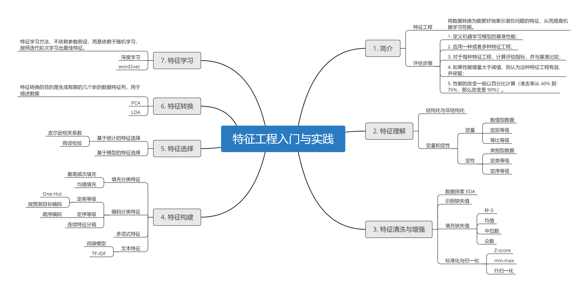


具体特征工程的代码实践参考本目录下

1. `特征工程，特征选择实践_ 基于泰坦尼克数据.ipynb`: 较为简单的入门练习
2. `特征工程入门与实践-book.ipynb`: 本文章的配套实践


## 一、特征工程简介

数据科学家在工作中 80% 的时间都用在捕获、清洗、组织数据上。

**特征工程：**将数据转换为能更好地表示潜在问题的特征，从而提高机器学习性能。


**特征工程的评估步骤**

1. 定义机器学习模型的基准性能；
2. 应用一种或者多种特征工程；
3. 对于每种特征工程，计算评估指标，并与基准比较；
4. 如果性能增量大于阈值，则认为这种特征工程有益，并保留；
5. 性能的改变一般以百分比计算（准去率从 40% 到 76%，那么改变是 90%）。


**探索领域**

监督学习

- 回归： 主要使用均方误差
- 分类：主要使用准确率

无监督学习

- 聚类：主要使用轮廓稀疏

统计检验

用相关系统，t检验、卡方检验


**特征工程可以分为以下部分：**

1. 特征理解：查看数据
2. 特征增强：清洗数据
3. 特征选择：清楚有害或者无用特征，减少数据噪声
4. 特征构建：生成新特征
5. 特征转换：降维等数学方法转换数据
6. 特征学习：Embedding

## 二、特征理解

在进行机器学习建模之前，首先看看我们的数据里面有什么。

### 2.1 结构化与非结构化

结构化：表格形式数据	

非结构化：非表格数据，如日志、文本等

### 2.2 定量和定性

- 定量：数值

- 定性：类别

有时候一个特征既可以是定性也可以是定量，比如餐厅的评分星级。


可以将数据分为4个等级：

**定性**

1. 定类等级
2. 定序等级

**定量**

1. 定距等级
2. 定比等级

#### 定类等级

一般为字符串类型，按名称分类，如血型、人名、职位等等。可以对其进行计数，绘制条形图、饼图。

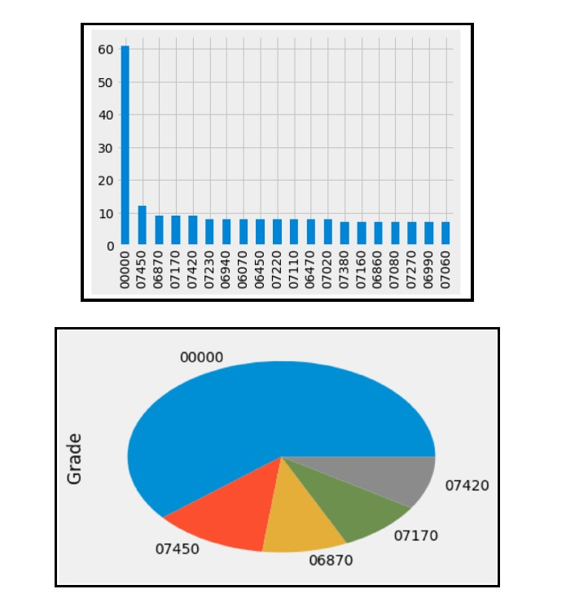

#### 定序等级

同样是类别数据，但是在定类等级的基础上，增加数值含义。数据可以自然排序，即有大小关系。比如考试成绩（A、B、C、D)。

在次基础上就可以计算中位数，百分位数等等，增加绘制茎叶图和箱线图。

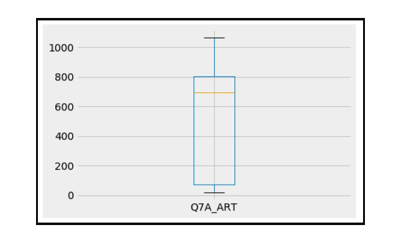

####  定距等级

定量数据，数值可以加减比较。比如温度。从而可以计算均值和标准差，绘制统计直方图（将数据分桶统计个数）、折线图。

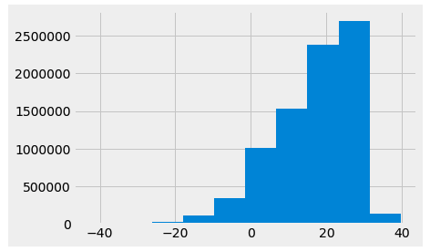


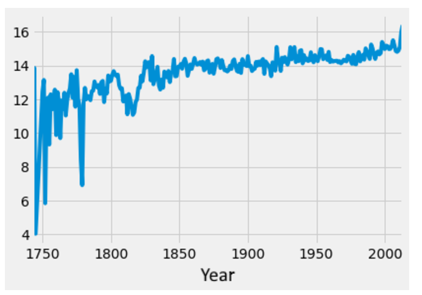

#### 定比等级

在定距的基础上，增加了一个**绝对零点**的概念，数值可以做乘除运算。比如价格100元是50元的两倍，10KG是100KG的十分之一，而温度比较主观，并不能说100度是50度的两倍。

下图展示了不同职位的的平均工资情况。

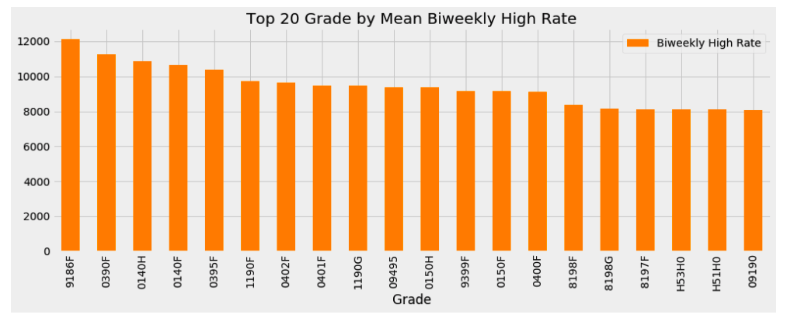

数据等级总结，图片参考自 https://mp.weixin.qq.com/s/A4Eoe86obZ3ysesuv_CfUg 

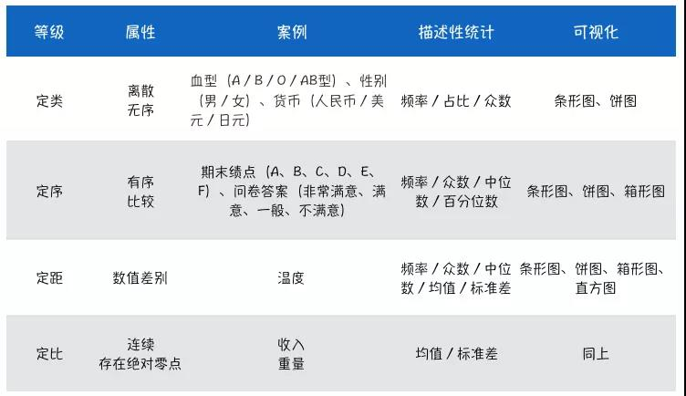

理解数据的过程

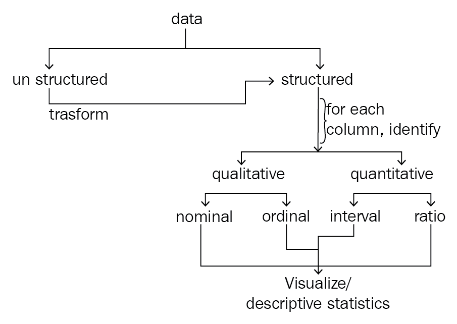

## 三、特征清洗与增强

特征增强的意义是，试别有问题的数据，并确定哪种修复方法最有效，而不是简单的删除了事。

包括一下三个步骤：

1. 探索数据
2. 发现数据中的缺失值
3. 删除或者填补数据中的缺失值
4. 标准化与归一化


### 3.1 探索数据

通过数据统计分析，查看数据的分布情况。

**常用方法**

- df.head()
- df.describe()
- 可视化分析
- sns.heatmap(df.corr())， 画热力图


### 3.2 识别缺失值

**常用方法**

- df.isnull().sum()

缺失值的形式可能有：

- 0
- unkown
- ?

在初步查看没有缺失值的时候，需要看一看数据中是不是有不符合常理的值，可能默认已经用其他值填补了缺失值。

以下方法用来将0值替换为 None

- df.replace([0], [None], inplace=True)

### 3.3 填充缺失值

- 补0
- 均值
- 中位数
- 众数

**注意：需要在划分训练集和测试集之后进行填充**，因为我们需要用训练数据学习得到的模式应用到测试集中。

**常用方法：**

- df.fillna()
- df[col].replace([0], [xxx], inplace=True)

### 3.4 标准化与归一化

- Z-score
- min-max
- 行归一化

特征尺度不一致需要标准化，以下算法会受尺度影响

- KNN，依赖距离
- K-meas
- 逻辑回归，支持向量机，神经网络等如果使用梯度下降来学习权重；
- 主成分分析，特征向量偏向于较大的列

在机器学习 Pipeline中使用归一化

```python
from sklearn.pipeline import Pipeline
from sklearn.neighbors import KNeighborsClassifier
from sklearn.model_selection import GridSearchCV
from sklearn.model_selection import train_test_split
from sklearn.preprocessing import Imputer

knn_params = {'imputer__strategy':['mean', 'median'], 'classify__n_neighbors': [1,2,3,4,5,6,7]}

knn = KNeighborsClassifier()

mean_inpute = Pipeline([('imputer', Imputer(strategy='mean')), 
                        ('standardize', MinMaxScaler()),
                        ('classify', knn)
                       ])

grid = GridSearchCV(mean_inpute, knn_params)
grid.fit(X_train, y_train)
```

## 四、特征构建

使用现有的特征构建新的特征，让模型从中学习。

### 4.1 填充分类特征

**常用方法**

- X['city'].fillna(X['city'].value_counts().index(0)) ,使用出现频次最高的类别来填充


机器学习流水线（Pipeline）的中间步骤都为转换操作，按顺序进行转换，从而将几个可以交叉验证的步骤组装在一起，并设置不同的参数。我们通过自定义填充器后就可以传入 Pipeline。

#### 基于 scikit-learn 自定义分类填充器

```python
# 自定义分类填充器
from sklearn.base import TransformerMixin

class CustomCategoryImputer(TransformerMixin):
    def __init__(self, cols=None):
        self.cols = cols
        
    def transform(self, df):
        X = df.copy()
        for col in self.cols:
            X[col].fillna(X[col].value_counts().index[0], inplace=True)
        return X
    
    def fit(self, *_):
        return self
```


#### 基于 scikit-learn 自定义定量填充器

```python
from sklearn.preprocessing import Imputer

# 自定义填充器，填充定量列
class  CustomQuantitativeImputer(TransformerMixin):
    def __init__(self, cols=None, strategy='mean'):
        self.cols = cols
        self.strategy = strategy
        
    def transform(self, df):
        X = df.copy()
        impute = Imputer(strategy=self.strategy)
        for col in self.cols:
            X[col] = impute.fit_transform(X[[col]])
        return X
    
    def fit(self, *_):
        return self
```

使用 Pipline 进行填充

```python
cci = CustomCategoryImputer(cols=['city', 'boolean'])
cqi = CustomQuantitativeImputer(cols=['quantitative_column'], strategy='mean')

imputer = Pipeline([('quant', cqi), ('category', cci)])
imputer.fit_transform(X)
```


### 4.2 编码分类变量

通过编码让类别数据转换成数值，从而输入机器学习模型中。

#### 定类等级编码

虚拟变量（dummy variable），即经典方法 One-Hot encoding， 以 1 或 0 代替某个类别的有无，有多少个类别就增加多少列，从而将类别转化为数值，并且可以学习不同类别的权重。

**注意虚拟变量陷阱**，自变量高度相关，比如性别特征，男女可以使用  1 和 0 分别表示，那么就不需要再编码成两列了。

**常用方法**

- pandas: pd.get_dummies()
- scikit-learn: OneHotEnconding

#### 定序等级编码

如果类别特征本身有顺序含义，那么将其编码为 0，1，2 .... 即可。

**常用方法**

- scikit-learn LabelEncoding

#### 连续特征分箱

将数值特征分成多个区间，对区间进行编码。

**常用方法**

- pd.cut() 等距分箱
- pd.qcut() 等频分箱


### 4.3 多项式特征

即特征做多项式变化，特征次方，交叉。

[a, b]  --> [1, a, b ,ab , a^2, b^2]

**常用方法：**

- scikit-learn: PolynomialFeatures
  - degree: 特征阶数
  - interaction_only:  True, 只保留交叉特征
  - include_bias: True, 阶数为 0 的偏差列，即生成全 1 列

### 4.4 文本特征

文本比定类数据更加复杂，其中包括多个单词。理解文本的含义，从中获取信息，比如情绪分析，这种工作称为**自然语言处理** （Natural Language Processing, NLP）。

#### 词袋法 **(bag of words，BOW）** 

词袋模型能够把一个句子转化为向量表示。顾名思义， 此模型下，一段文本（比如一个句子或是一个文档）可以用一个装着这些词的袋子来表示，词的数量即为这个词的重要性，忽略了词在文档中的位置。

举例如下

```
"John likes to watch movies, Mary likes movies too"

"John also likes to watch football games"
```

 对于这两个句子，我们要用词袋模型把它转化为向量表示，这两个句子中所有的词为： 

```
[
    "John",
    "likes",
    "to",
    "watch",
    "movies",
    "also",
    "football",
    "games",
    "Mary",
    "too"
]
```

那么这两个句子可以表示为以下两个向量，其中对应的索引位置表示词在句子中出现的次数。

```
(1) [1, 2, 1, 1, 2, 0, 0, 0, 1, 1] 
(2) [1, 1, 1, 1, 0, 1, 1, 1, 0, 0] 
```

**常用方法**:

- scikit-learn 中的 CountVectorizer()

#### TF-IDF

BOW 模型由于只考虑词频，无法反应出一个句子的关键词，比如下面这个句子：

```
"John likes to play football, Mary likes too"
```

这个句子若用 BOW 模型，它的词表为：[‘football’, ‘john’, ‘likes’, ‘mary’, ‘play’, ‘to’, ‘too’]，则词向量表示为：[1 1 2 1 1 1 1]。若根据 BOW 模型提取这个句子的关键词，则为 “like”，但是显然这个句子的关键词应该为 “football”。而 TF-IDF 可以解决这个问题。

TF-IDF（Term Frequency - Inverse Document Frequency）

**TF**: 即词频，表示某个词在当前文档中出现的次数：
$$
TF(w)=\frac{单词w在文档中出现的次数}{文档单词总数}
$$


**Inverse Document Frequency**： 逆文档频率
$$
IDF=log(\frac{语料库中文档的总数}{包含词w的文档数+1})
$$
如果一个词越常见，那么分母就越大，逆文档频率就越小越接近 0。分母之所以要加1，是为了避免分母为 0（即所有文档都不包含该词）。通过 TF 与 IDF 相乘，从而对非常常见的词加惩罚。


TF-IDF 有如下含义：

**如果某个词在所有语料库的文档中比较少见，但是它在这篇文档中多次出现，那么它很可能就反映了这文档的特性，正是我们所需要的关键词。**


**优缺点**

TF-IDF的优点是简单快速，而且容易理解。缺点是有时候用**词频**来衡量文章中的一个词的重要性不够全面，有时候重要的词出现的可能不够多，而且这种计算无法体现位置信息，无法体现词在上下文的重要性。如果要体现词的上下文结构，那么你可能需要使用 word2vec 算法来支持。


**常用方法**

- scikit-learn 中的 TfidfVectorizer()


## 五、特征选择

从所有特征中选择一个对模型预测重要性高的子集，从而提高模型预测能力，降低时间成本。特征选择的方法主要分为两类，基于统计的特征选择和基于模型的特征选择。

通过以下函数选择最佳模型参数

```python
from sklearn.model_selection import GridSearchCV
def get_best_model_and_accuracy(model, params, X, y):
    grid = GridSearchCV(estimator=model, 
                        param_grid=params, 
                        error_score=0.)# if a parameter set raises an error, continue and set the performance as a big, fat 0
    grid.fit(X, y)
    
    # 最佳准确率
    print("Best Accuracy: {}".format(grid.best_score_))
    # 最佳模型参数
    print("Best parameters: {}".format(grid.best_params_))
    # 平均训练时间
    print("Average Time to Fit (s): {}".format(round(grid.cv_results_['mean_fit_time'].mean(), 3)))
    # 平均预测时间
    print("Average Time to Score (s): {}".format(round(grid.cv_results_['mean_score_time'].mean(), 3)))
    return grid
```


### 5.1 基于统计的特征选择

##### 皮尔逊相关系数

返回的值在 -1 到 1 之间，绝对值越大代表相关性越强 。

自定义转换器，使用皮尔逊相关系数提取重要特征列。

```python
from sklearn.base import TransformerMixin, BaseEstimator

class CustomCorrelationChooser(TransformerMixin, BaseEstimator):
    def __init__(self, response, cols_to_keep=[], threshold=None):
        # 目标列
        self.response = response
        # 阈值
        self.threshold = threshold
        # 需要保留的列
        self.cols_to_keep = cols_to_keep
        
    def transform(self, X):
        return X[self.cols_to_keep]
    
    def fit(self, X, *_):
        df = pd.concat([X, self.response], axis=1)
        self.cols_to_keep = df.columns[df.corr()[df.columns[-1]].abs() > self.threshold]
        self.cols_to_keep = [c for c in self.cols_to_keep if c in X.columns]
        return self
```

##### 假设检验

假设检验的**原则**是：特征与目标变量没有关系（零假设）为真还是假。p 值是介于 0 和 1 的小数，代表给定数据偶然出现的概率。简而言之，p 值越低，拒绝零假设的概率越大，即 p 值越低，这个特征就越重要。

工具：sklearn SelectKBest

```python
from sklearn.feature_selection import SelectKBest
# This models a statistical test known as ANOVA
from sklearn.feature_selection import f_classif

k_best = SelectKBest(f_classif, k=5)
k_best.fit_transform(X, y )

p_values = pd.DataFrame({'column': X.columns, 'p_value': k_best.pvalues_}).sort_values('p_value')
p_values[p_values['p_value'] < .05]     
```

### 5.2 基于模型的特征选择

##### 树模型特征选择

直接调用模型中的  `feature_importances_ ` 来进行特征选择。

```python
tree = DecisionTreeClassifier()

tree.fit(X, y)

importances = pd.DataFrame({'importance': tree.feature_importances_, 'feature':X.columns}).sort_values('importance', ascending=False)

importances.head()
```

##### 线性模型特征选择

使用线性模型的参数作为特征权重。

关于正则化方法的理解，参考[理解 l1 和 l2 正则](https://www.cnblogs.com/zingp/p/10375691.html)。

```python
# l1 正则
lr = LogisticRegression(penalty='l1')

lr.fit(X, y)

importances = pd.DataFrame({'importance': lr.coef_.reshape(-1,), 
                            'feature':X.columns}).sort_values('importance', ascending=False)

importances[importances['importance'] >= .01]
```


**有几点做特征选择的方法经验：**

（1）如果特征是分类变量，那么可以从SelectKBest开始，用卡方或者基于树的选择器来选择变量；

（2）如果特征是定量变量，可以直接用线性模型和基于相关性的选择器来选择变量；

（3）如果是二分类问题，可以考虑使用 SelectFromModel和SVC；

（4）在进行特征选择前，还是需要做一下EDA。


## 六、特征转换

特征转换与特征选择的区别：特征选择仅限于从原始特征列中选择子特征集合，而特征转换的目的是生成有限的几个新的数据特征列，用于描述数据。

### 主成分分析 PCA

PCA （Principal component analysis）利用了协方差矩阵（d * d 的正方形矩阵）的特征值分解，将有多个相关特征的数据集投影到相关特征较少的坐标系中。这些新的、不相关的特征称为**主成分**。主成分分析会产生新的特征，最大化数据的方差。

```python
from sklearn.datasets import load_iris
import matplotlib.pyplot as plt
%matplotlib inline

from sklearn.decomposition import PCA

# 导入数据
iris = load_iris()
iris_x, iris_y = iris.data, iris.target

pca = PCA(n_components=2)
# 训练
pca.fit(iris_x)
pca.transform(iris_x)[:5,]

# 画图
label_dict = {i:k for i,k in enumerate(iris.target_names)}
def plot(x,y,title,x_label,y_label):
   ax = plt.subplot(111)
   for label,marker,color in zip(
   range(3),('^','s','o'),('blue','red','green')):
       plt.scatter(x=x[:,0].real[y == label],
                  y = x[:,1].real[y == label],
                  color = color,
                  alpha = 0.5,
                  label = label_dict[label]
                  )
       
   plt.xlabel(x_label)
   plt.ylabel(y_label)
   
   leg = plt.legend(loc='upper right', fancybox=True)
   leg.get_frame().set_alpha(0.5)
   plt.title(title)

plot(iris_x, iris_y,"original iris data","sepal length(cm)","sepal width(cm)")
plt.show()

plot(pca.transform(iris_x), iris_y,"Iris: Data projected onto first two PCA components","PCA1","PCA2")
```


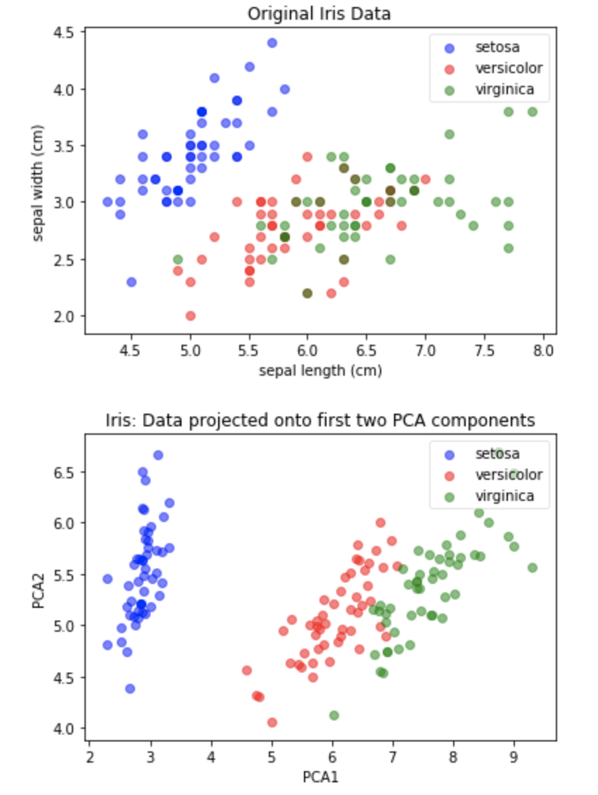

### 线性判别分析 LDA

LDA （linear discrimination analysis）是特征变换算法，为有监督分类。LDA 与 PCA 一样，也是将数据投影到一个低维空间中。与 PCA 的区别在于，LDA 不专注于数据的方差， 而是优化低维空间，以获得最佳的类别可分性。

```python
from sklearn.discriminant_analysis import LinearDiscriminantAnalysis

lda = LinearDiscriminantAnalysis(n_components=2)
# 训练
x_lda_iris = lda.fit_transform(iris_x, iris_y)
# 可视化
plot(x_lda_iris, iris_y, "LDA Projection", "LDA1", "LDA2")
```


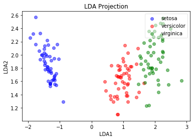

## 七、特征学习

上一节**特征转换**中提到的 PCA 和 LDA 算法都是基于参数假设（对数据形状的基本假设）来进行的。他们通过数学方法提取特征，每次都会学到相同的特征。本节介绍的**特征学习**方法，不依赖参数假设，而是依赖于随机学习，按照迭代轮次学习出最佳特征。特征学习往往使用深度学习算法。

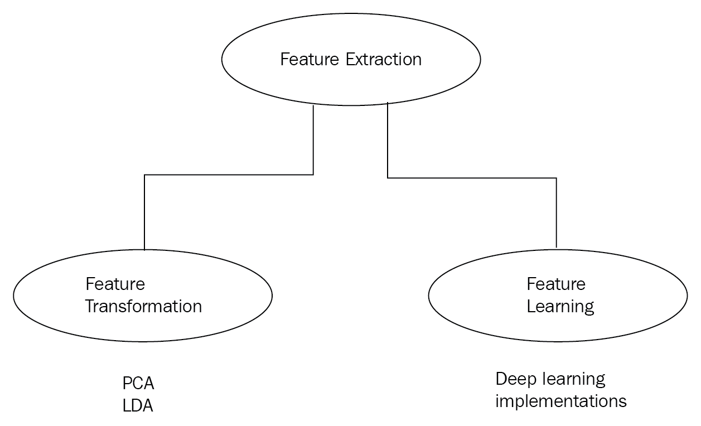

### 7.1 受限玻尔兹曼机 RBM

一种浅层（两层）的神经网络，一个可见层和一个隐藏层，隐藏层节点数为我们想要学习到的特征数。RMB 使用概率模型学习新的特征，在用其提取特征后使用线性模型往往效果更佳。

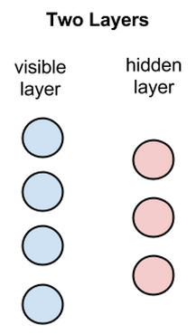

RBM 的学习来源于可见层和隐藏层之间的多重前后向传导。在数据重建（后向传导）时，使用前向传导的激活函数的结果作为输入，将隐藏层转换为输入层。从而不断迭代调整权重，生成性学习。

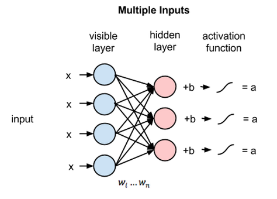

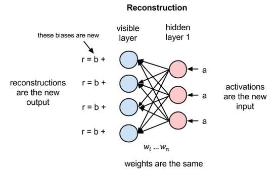

### 7.2 词嵌入 Word2vec

在 4.4 节中我们提到文本特征表示方法 BOW 和 TF-IDF，他们的缺点是用**词频**来衡量文章中的一个词的重要性不够全面，有时候重要的词出现的可能不够多，而且这种计算无法体现位置信息，无法体现词在上下文的重要性。本节介绍谷歌提出的 Word2vec 就能解决这一问题。

Word2vec 也是一个浅层神经网络，包括一个输入层、一个隐藏层、一个输出层，其中隐藏层为我们要学习的特征数，输入层和输出层为语料库中的词数。

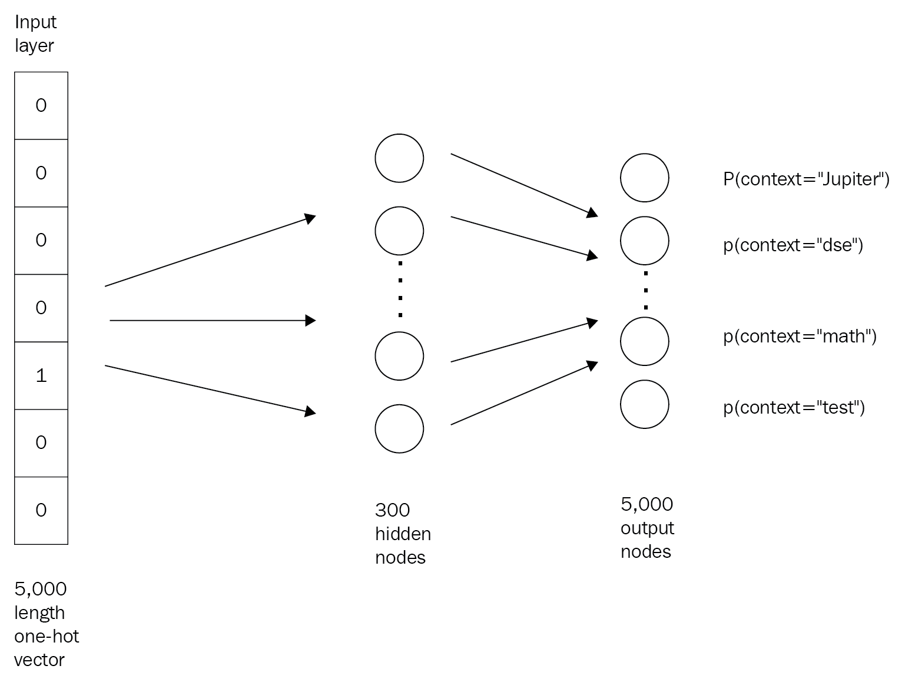

通过把词转换为词向量表示，可以应用于相似词搜索，通过关键词搜索标题（将标题中的词向量取均值）等等。如下图，可以表示学习到词向量之后，将国王性别从男变成女，转换成向量计算（king + woman - man）的形式。

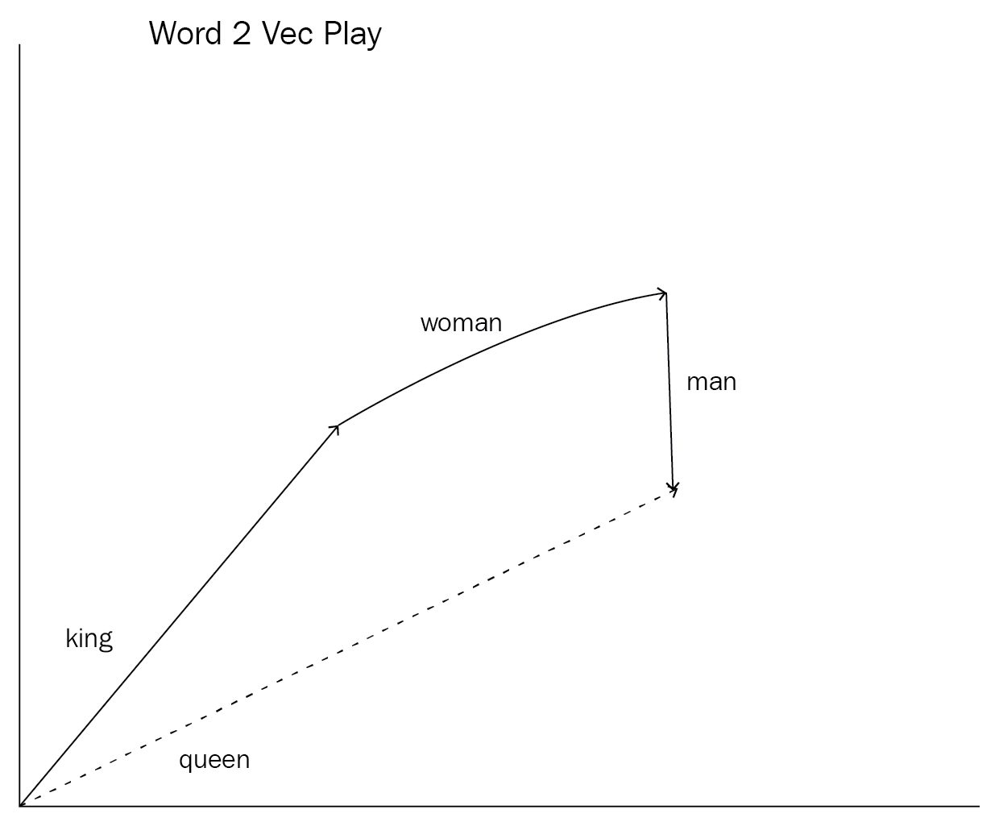


## 八、总结

本文详细介绍了特征工程的各种技巧。特征工程是工作中占用时间最大的一部分，了解技巧是一方面，更重要的是在实际工作中针对不同的场景应用特征工程，从而提高模型的效果。机器学习炼丹永无止境。


具体特征工程的代码实践参考我的 repo：

https://github.com/Skyexu/machine-learning-practice/tree/master/feature_engineering


## 参考

- 特征工程入门与实践. 人民邮电出版社

-  https://github.com/PacktPublishing/Feature-Engineering-Made-Easy

