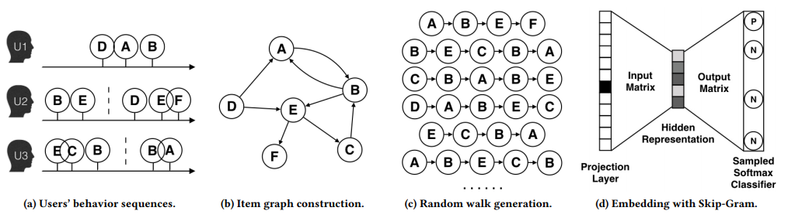

## DeepWalk

> Author: Skye
>

paper:  [DeepWalk: Online Learning of Social Representations](http://www.perozzi.net/publications/14_kdd_deepwalk.pdf)（KDD 2014）

**应用场景**

- 社交推荐，以 user 作为节点构建图
- 商品推荐，获取用户对 item 的行为序列， 用 item 共现关系构建图

## 代码说明

- `./graph_embedding_deepwalk_local.py`: deepwalk 的单机实现；
- `./graph_embedding_deepwalk_spark.py`: deepwalk 的 spark 实现；

## 运行效率

- 边数：14806080 
- 节点数：1266412 
- 句子数：10131296

|         | 随机游走参数                | word2vec参数                                                | 随机游走运行时间 | word2vec运行时间 |
| ------- | --------------------------- | ----------------------------------------------------------- | ---------------- | ---------------- |
| 单机版  | walk_length=30, num_walks=8 | embed_size=128, window_size=10, iter=5, works=3             | 31 分钟          | 7小时56分钟      |
| spark版 | walk_length=30, num_walks=8 | vectorSize=128, numPartitions=10, stepSize=0.025, maxIter=3 | 15 分钟          | 1小时40分钟      |

## 算法概述

**Deepwalk** 的主要思想是在由物品组成的图结构上进行随机游走，产生大量物品序列，然后将这些物品序列作为训练样本输入word2vec进行训练，得到物品的embedding。

**RandomWalk**是一种**可重复访问已访问节点的深度优先遍历**算法。给定当前访问起始节点，从其邻居中随机采样节点作为下一个访问节点，重复此过程，**直到访问序列长度满足预设条件**。

*图源：https://arxiv.org/pdf/1803.02349.pdf*

**算法流程**：

1. 图a展示原始的用户行为序列
2. 图b基于这些用户行为序列构建了物品相关图，可以看出，物品A，B之间的边产生的原因就是因为用户U1先后购买了物品A和物品B，所以产生了一条由A到B的有向边。如果后续产生了多条相同的有向边，则有向边的权重被加强。在将**所有用户行为序列都转换成物品相关图中的边之后**（**原始的deepwalk paper中是没有权重的，就是randomWalk**），得到全局的物品相关图。
3. **图c采用随机游走的方式随机选择起始点，对每个节点重新生成部分物品序列（采样）。**得到局部相关联的训练数据，deepwalk 将这组序列当成语言模型的一个短句，最大化给定短句某个中心词时，出现上下文单词的概率。
4. 图d最终将这些物品序列输入word2vec模型，生成最终的物品Embedding向量。

>  **参考资料：**
>
> 1. https://zhuanlan.zhihu.com/p/56380812
> 2. https://zhuanlan.zhihu.com/p/90783845